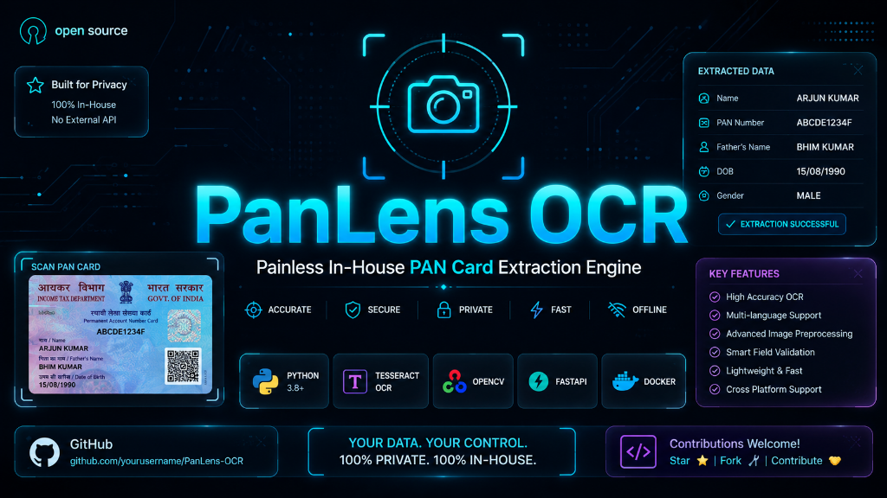
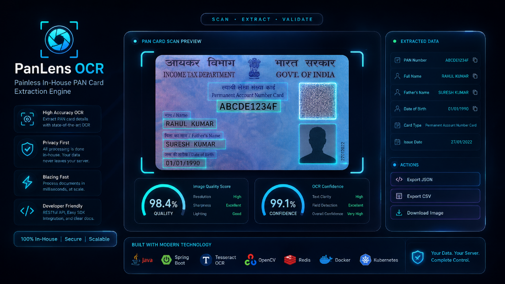
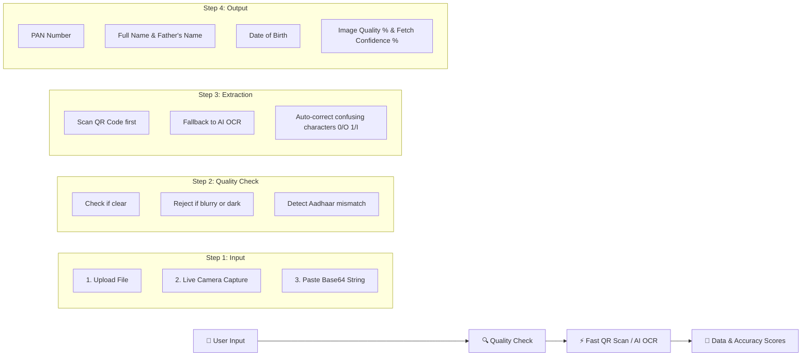

# 💳 PanLens OCR - Painless In-House PAN Card Data Extraction Engine

<p align="center">
  
</p>

An intelligent, high-performance in-house microservice that reads customer-uploaded PAN card photos, scans QR codes or extracts text automatically and returns clean structured data (PAN Number, Full Name, Father's Name and DOB) with instant quality & accuracy scores.

<p align="center">
  
  
  
  
  
</p>

---

## 📸 Interactive Dashboard & Scan Preview

<p align="center">
  
</p>

---

## 🌟 How It Works (In Simple Words)

When a customer uploads their PAN card during onboarding, PanLens OCR processes the image through four easy steps:



1. **3 Input Options**: You can upload a photo from your computer, take a live picture using your camera or paste a base64 image string.
2. **Instant Quality Screening**: Before running AI models, PanLens OCR checks if the photo is blurry, dark or cut off. If a user accidentally uploads an Aadhaar card instead of a PAN card, it lets them know immediately.
3. **Smart Extraction**: Reads the QR code on 2018+ cards instantly. If no QR code is found, the DJL PaddleOCR AI model reads the text lines and fixes common OCR letter/number confusions (like fixing letter `O` into number `0` in digit positions).
4. **Detailed Metrics Output**: Delivers verified fields along with **Image Quality %**, **Fetch Extraction %** and **Correction Accuracy %**.

---

## 🏢 Real-Life Onboarding Example

Imagine a customer opening a digital wallet or bank account on their smartphone.

### 1. Customer Uploads PAN Photo
The customer snaps a picture of their PAN card on their mobile browser using our live camera option.

### 2. Backend Extraction Response
PanLens OCR processes the photo in under 2 seconds and returns this simple structured response:

```json
{
  "success": true,
  "source": "QR",
  "panNumber": "ABCDE1234F",
  "name": "ANAND KUMAR",
  "fatherName": "SURESH KUMAR",
  "dob": "15/08/1995",
  "qualityMetrics": {
    "qualityPercentage": 96.5,
    "blurScore": "Clear Focus",
    "resolution": "800x500px"
  },
  "confidence": {
    "panNumber": 0.994,
    "name": 0.952,
    "fatherName": 0.938,
    "dob": 0.981
  }
}
```

### 3. Customer Verification on UI
The customer sees their details auto-filled into the form automatically without typing a single letter manually!

---

## 🛠️ Tech Stack & Tools

| Component | Technology | Purpose |
| :--- | :--- | :--- |
| **Backend Core** | Java 21 LTS + Spring Boot 3.4.2 | High-speed microservice backend |
| **AI OCR Engine** | DJL (Deep Java Library) + PaddleOCR | Offline text detection, recognition and angle correction |
| **QR Code Scanner** | ZXing (Pure Java) | Fast-path QR decoding for modern PAN cards |
| **Image Preprocessing** | Java BufferedImage + OpenCV bindings | Downscaling, Laplacian blur detection and lighting checks |
| **Frontend Dashboard** | Glassmorphism HTML5, Vanilla CSS3 and JS | Responsive testing dashboard for mobile & desktop |

---

## 🚀 API Endpoint Guide

### `POST /api/v1/ocr/pan`

**Request:**
```json
{
  "image": "<base64_encoded_image_string>",
  "requestId": "req-9821abc"
}
```

**Success Response (200 OK):**
Returns `success: true`, extracted fields, overall confidence percentages and quality scores.

**Rejection Response (200 OK):**
If the photo is blurry or dark, returns clear user feedback:
```json
{
  "success": false,
  "errorCode": "IMAGE_BLURRY",
  "message": "The photo is too blurry. Please take a clear picture under good light."
}
```

---

## 💻 Quick Start & Running Locally

### 1. Run via Web Browser (Standalone Dashboard)
Simply open `index.html` in any web browser to test all three input options (File Upload, Camera Capture and Base64) with live preset cards.

### 2. Run Spring Boot Service
```bash
./mvnw spring-boot:run
```
Access the application at `http://localhost:8083`.

### 3. Run with Docker Container
```bash
docker build -t pan-ocr-service:1.0.0 .
docker run -p 8083:8083 pan-ocr-service:1.0.0
```

---

## 🔒 Privacy & Safety
- **100% In-Memory Processing**: Images are processed directly in RAM and never saved to disk or external cloud storage.
- **Log Masking**: PAN numbers and base64 strings are automatically masked in log files for security (`ABCDE1234F` -> `AB***1234F`).

---

## 📄 License
Licensed under Apache-2.0 License.
